# jackwiegman.dev — Portfolio Website

Personal portfolio site built with plain HTML, CSS, and no build tooling. Designed to be hosted statically (GitHub Pages, Netlify, etc.).

## Pages

| Page | File | Description |
|---|---|---|
| Home | `index.html` | Hero, skills grid, featured project cards |
| About | `about.html` | Bio and background |
| Projects | `projects.html` | Project cards with tech tags and GitHub links |
| Resume | `resume.html` | Full resume with photo and PDF download |
| Contact | `contact.html` | Email, GitHub, phone |

## Running locally

```bash
python3 -m http.server 8080
# open http://localhost:8080
```

## Site structure

### Navigation flow



### File dependencies



## Diagrams

Source files for the diagrams above live in `docs/`. To regenerate after changes:

```bash
mmdc -i docs/sitemap.mmd -o docs/sitemap.svg -t dark -b '#0d1117' -w 900 -H 600
mmdc -i docs/assets.mmd  -o docs/assets.svg  -t dark -b '#0d1117' -w 900 -H 400
```
